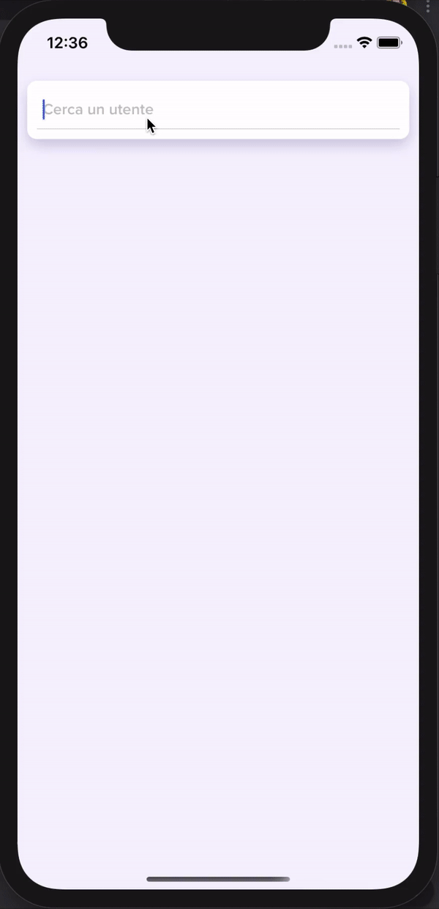

# 👨🏼‍💻 Installazione progetto

copiare il file **.env.example.ts** in **.env.ts** e popolare le seguenti chiavi:

- githubToken: https://github.com/settings/tokens

installare le dipendenze per react-native con: `yarn install`

installare le dipendenze per ios con: `cd ios && pod install && cd ..`

avviare il progetto in modalità sviluppo con: `yarn start`

# 🤳🏼 Avviare su iOS
per iOS aprire XCode e aprire il file: `/ios/docebo.xcworkspace`

# 🤳🏼 Avviare su Android
per Android aprire Android Studio e aprire la cartella il file: `/android`

# 📖 Documentazione

### 📱 Elementi visivi
- UI
  - Elements: tutti i componenti che non condivideranno mai lo stato con l'applicazione
  - Components: tutti i componenti che condividono lo stato con l'applicazione
  - Screens: tutti gli screen dell'applicazione

### ⬆️ Router
la cartella Router si occupa di gestire il routing dell'applicazione:
- Router.component.tsx: è il componente che permette di visualizzare le schermate
- index.ts: è il file in cui ci sono descritte tutte le schermate che esistono nell'applicazione
- config.router.ts: è il file che descrive l'apertura delle schermate e collega l'id dello screen con il componente UI
- transitions: ci sono descritti tutti i metodi di apertura delle schermate

### 🗂 Stato applicazione
sotto la cartella AppState c'è descritto lo stato

### 🏗 State Updaters
gli StateUpdaters sono funzioni che ritornano oggetti di tipo `Action` che vengono passati al reducers (`AppState/reducer.ts`) il quale richiama la funzione **updateState** che permette allo StateUpdater di decidere come modificare lo stato

### 📡 Side Effects
i SideEffects sono gestiti con redux-saga

### 🎨 Resources
sotto la cartella Resources si trovano:
- Dimensions: dove ci sono descritte le dimensioni che andranno condivise con tutta l'applicazione, ovvero gli spazi ecc, tutto quello che viene fuori dal design system
- Fonts: tutti i font che ci sono nell'applicazione, che possono essere importati grazie al comando: `yarn link:font`
- Images: tutte le immagini dell'applicazione
- Lottiefiles: i file JSON per lottie
- Strings: tutte le traduzioni dell'applicazione
- Themes: i temi dell'applicazione
